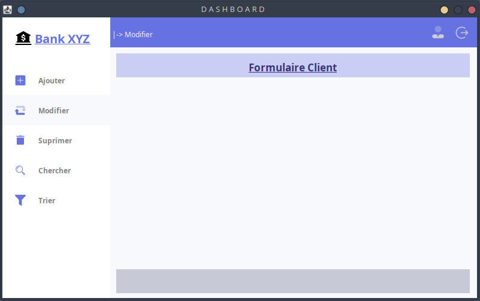
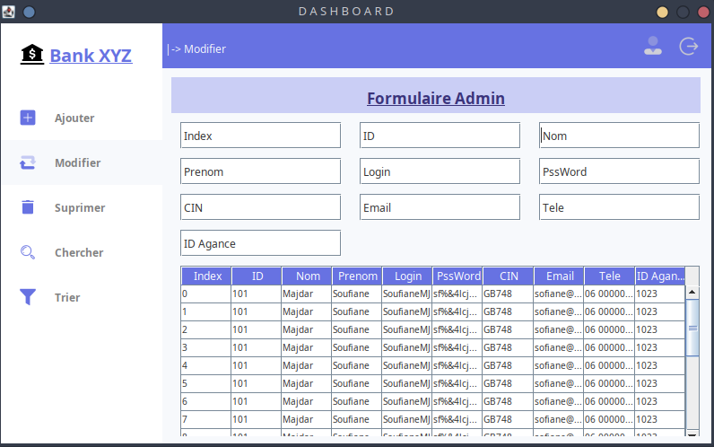

# Project Title

## Table of Contents

- [About](#about)
- [Demo](#demo)
- [Getting Started](#getting_started)
- [Usage](#usage)
- [Authors](#authors)
- [License](#license)
- [Contact](#contact)
- [Project Status](#status)

## About <a name = "about"></a>

Add more about your project and overview of use.

## Demo <a name = "demo"></a>

</img>
</img>

## Getting Started <a name = "getting_started"></a>

These instructions will get you a copy of the project up and running on your local machine for development and testing purposes. See deployment for notes on how to deploy the project on a live system.

### Prerequisites

What things you need to install the software and how to install them.

```
Give examples
```

### Installing

A step by step series of examples that tell you how to get a development env running.

Say what the step will be

```
Give the example
```

And repeat

```
until finished
```

End with an example of getting some data out of the system or using it for a little demo.

## Usage <a name = "usage"></a>

Add notes about how to use the system.

## ✍️ Authors <a name = "authors"></a>

- [@Soufiane-Majdar](https://github.com/Soufiane-Majdar)

## 📝 License <a name = "license"></a>

This project is licensed under the MIT License - see the LICENSE.md file for details

## 📝 Contact <a name = "contact"></a>

- [Soufiane Majdar](https://www.linkedin.com/in/soufiane-majdar-47613719a/)

## 📝 Project Status <a name = "status"></a>

- [x] Project is: _in progress_
- [ ] Project is: _finished_
- [ ] Project is: _no longer continue_
