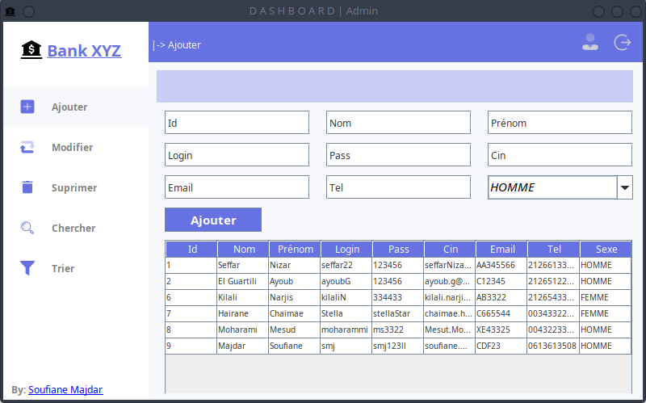

# Project Title

## Table of Contents

- [About](#about)
- [Demo](#demo)
- [Getting Started](#getting_started)
- [Usage](#usage)
- [Authors](#authors)
- [Contact](#contact)
- [Project Status](#status)

## About <a name = "about"></a>

Add more about your project and overview of use.

## Demo <a name = "demo"></a>

<video src="git_img/Bank_Gui.mkv"></video>


## Getting Started <a name = "getting_started"></a>

Le projet banque en Java avec JFrame est une application de bureau qui permet de simuler des opérations bancaires de base. Cette application utilise la programmation orientée objet en Java pour gérer les différents aspects de la banque, tels que les clients, les comptes, les transactions et les opérations bancaires.

### Installing

```
git clone https://github.com/Soufiane-Majdar/Bank_GUI.git
```

## ✍️ Authors <a name = "authors"></a>

- [@Soufiane-Majdar](https://github.com/Soufiane-Majdar)

## 📝 Contact <a name = "contact"></a>

- [Soufiane Majdar](https://www.linkedin.com/in/soufiane-majdar-47613719a/)

## 📝 Project Status <a name = "status"></a>

- [x] Project is: _in progress_
- [ ] Project is: _finished_
- [ ] Project is: _no longer continue_
